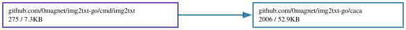

# img2txt-go

A Go port of [libcaca](https://github.com/cacalabs/libcaca)'s `img2txt`
(0.99.beta20) by Sam Hocevar and Jean-Yves Lamoureux. It converts images to
coloured ASCII/ANSI art and to every text format libcaca supports.

No cgo, no libcaca, no Imlib2 — a single static binary.

## Install

```
go install github.com/0magnet/img2txt-go/cmd/img2txt@latest
```

## Use

The command line matches the original:

```
img2txt -W 80 -f ansi image.png
img2txt -W 100 -f utf8 -d ordered8 photo.png
img2txt -W 60 -f html image.png > art.html
```

Pipe it into [ansifilter-go](https://github.com/0magnet/ansifilter-go) to get
HTML with the same markup ansifilter produces:

```
img2txt -W 80 -f ansi image.png | ansifilter -H -f
```

## What is ported

Dithering algorithms: `none`, `ordered2`, `ordered4`, `ordered8`, `random`,
`fstein` (default). Options `-W/-H` (size), `-x/-y` (font cell size),
`-g` (gamma, negative inverts), `-b` (brightness), `-c` (contrast).

Export formats: `caca`, `ansi`, `utf8`, `utf8cr`, `html`, `html3`, `bbfr`,
`irc`, `ps`, `svg`, `tga`, `troff` — all twelve. TGA rasterises the canvas with
libcaca's built-in "Monospace 9" bitmap font, which is embedded in the binary.

Input formats: PNG, JPEG, GIF, BMP, TIFF and WebP. The original only reads
what Imlib2 supports, or BMP alone when built without it.

## Verification

Diffed against the system `img2txt` (libcaca 0.99.beta20, Imlib2 backend)
across images, sizes, dither algorithms and gamma settings: **1,536
comparisons, all byte-identical**. That covers 12-bit colour rounding, the
Floyd-Steinberg error diffusion, the `\033[s\n\033[u` special case at width 80,
alpha-transparent cells, and the TGA rasteriser down to the last blended
pixel.

Deliberately faithful details include the unsigned pixel accumulators whose
wraparound affects glyph choice and the skipped dither increment on transparent
cells.

Gamma is worth a note: libcaca ships two implementations of `gammapow`, a
portable series expansion and an x87 `FLDLN2`/`FSCALE` path that evaluates
`e^(y·ln x)` at 80-bit precision. Builds on x86 take the latter, and `math.Pow`
at float64 reproduces it exactly; the series expansion does not. If you compare
against a libcaca built for a platform without the assembly path, expect the
gamma table — and therefore a handful of dithered cells — to differ slightly.

## Known differences

- **JPEG input is not byte-identical.** Go's `image/jpeg` uses a different IDCT
  from libjpeg-turbo, so pixel values differ by ±1 and a small number of cells
  dither differently (in testing, ~48 glyphs out of a 30×24 canvas). Re-encode
  a JPEG to PNG and both implementations agree exactly, which confirms the
  difference is in the decoder rather than in this port. PNG, BMP and GIF are
  exact.
- **`-d random` is not reproducible**, in this port or the original: libcaca
  seeds its generator from the process id and a timer, so two runs of the C
  program disagree with each other too.
- `-b`/`-c` are accepted and stored but do not change the output. That is
  upstream behaviour: both setters are marked `FIXME` in libcaca and are never
  read by the dither.

## Licence

WTFPL, the same as libcaca. See `LICENSE`.

## Dependency Graph

Made with [goda](https://github.com/loov/goda):

```
go run github.com/loov/goda@latest graph github.com/0magnet/img2txt-go/... | dot -Tsvg -o docs/img2txt-go-goda-graph.svg
```



## Lines of Code

Made with [gocloc](https://github.com/hhatto/gocloc) (excludes `vendor/`, `node_modules/`, `.git/`):

```
gocloc --not-match-d='(vendor|node_modules|\.git)' .
```

```
-------------------------------------------------------------------------------
Language                     files          blank        comment           code
-------------------------------------------------------------------------------
Go                              10            272            180           2342
YAML                             1              0              7             98
Markdown                         1             21              0             61
-------------------------------------------------------------------------------
TOTAL                           12            293            187           2501
-------------------------------------------------------------------------------
```
